# xc-union

`xc-union` 是一个面向私域场景的开源返利平台基础工程，聚焦“快速搭建、开箱即用、可持续二开”。

如果你正在做返利工具、导购助手、社群分销小工具，`xc-union` 可以作为你的底座：  
前端负责转化体验，后端负责稳定接口与扩展能力，帮助你从 0 到 1 快速孵化独立的私域返利助手。

## 平台能力（H5 页面预览）

|  |  |  |  |
|---|---|---|---|
| 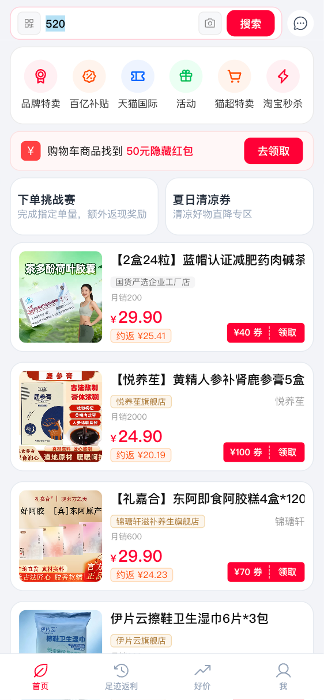 | 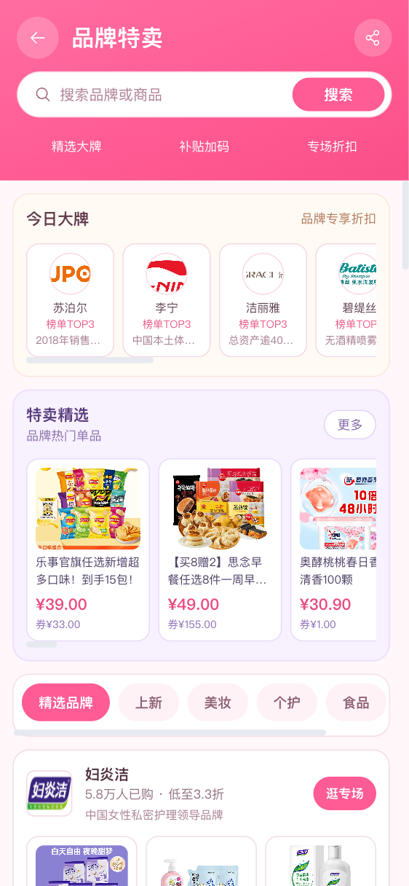 | 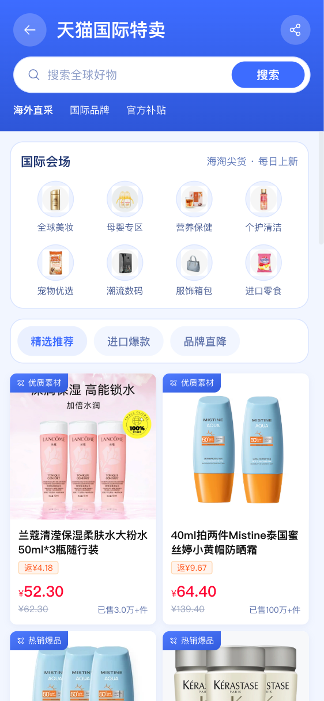 | 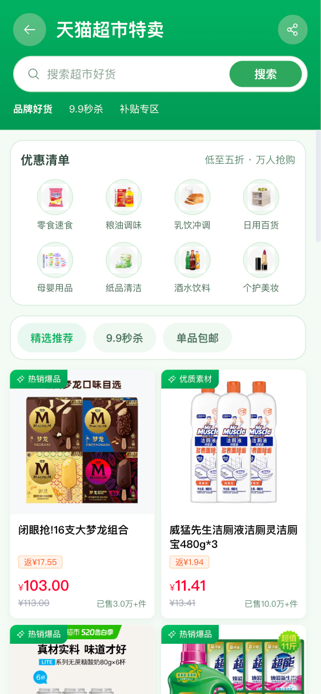 |
| 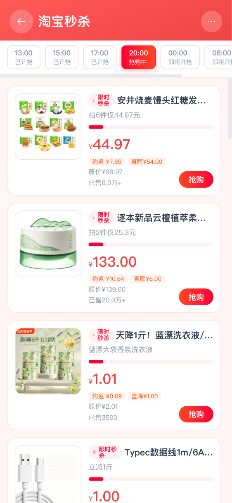 | 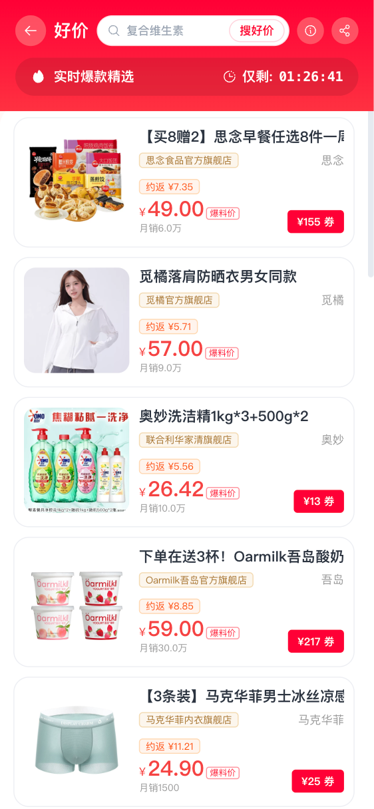 | 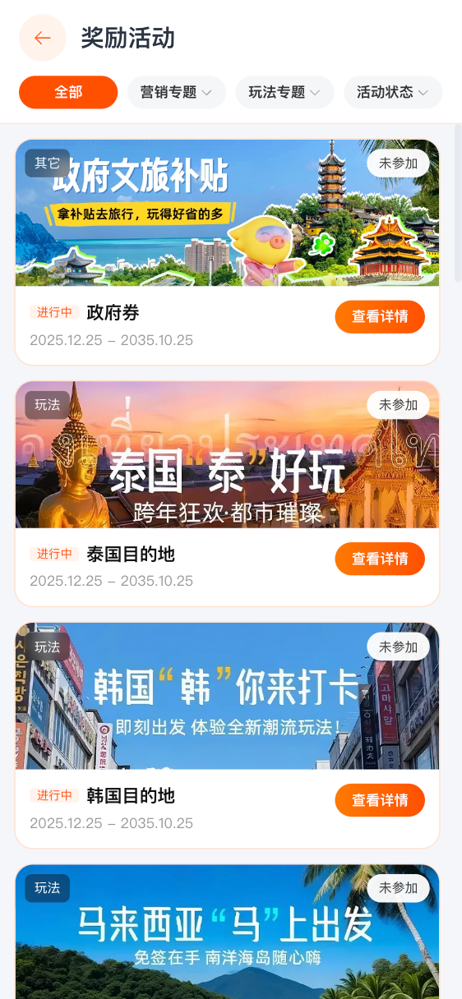 | 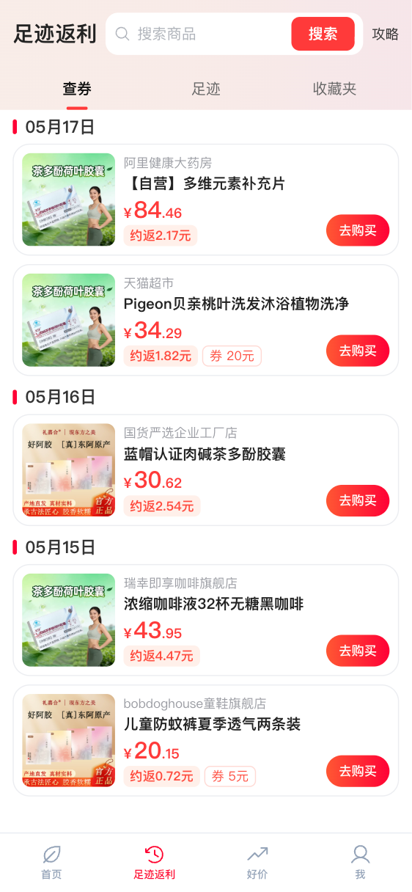 |
| 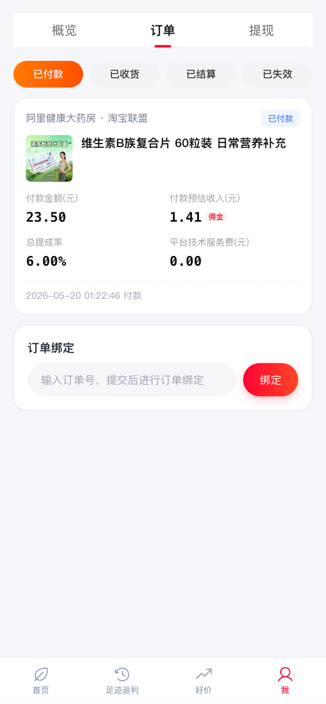 | 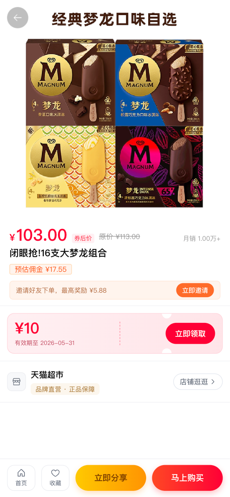 | 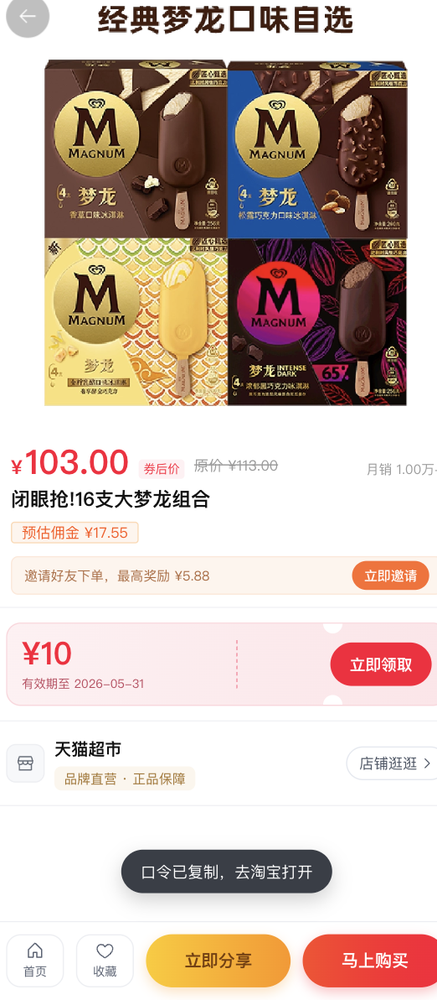 | 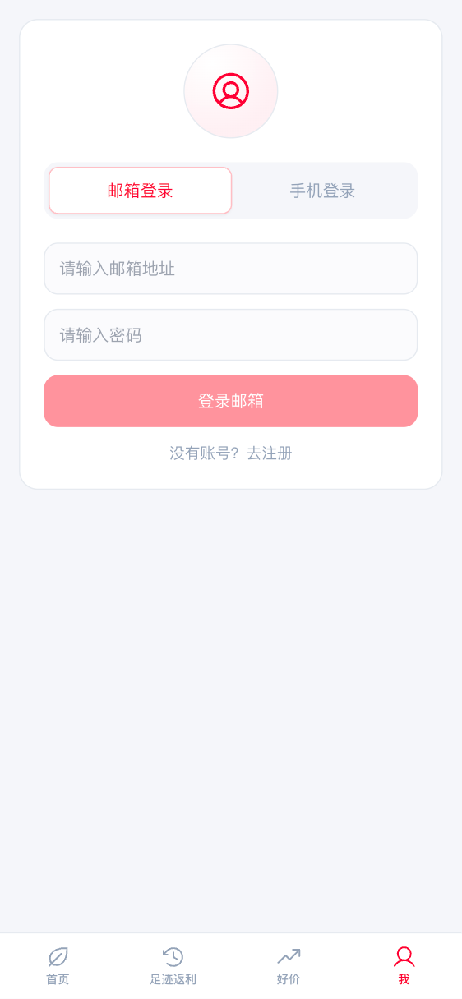 |

## 开源定位

- 系统已预留完整底层 API 能力，支持开发者直接接入业务。
- 支持按团队需求进行二次开发与模块扩展。
- 适合作为返利产品 MVP、私域助手、流量转化工具的技术底座。

## 测试环境说明

测试环境产生的返利，默认作为平台维护赞助，用于持续优化项目与社区服务。

## 仓库结构

- `xc-union-backend/`：后端聚合工程（Maven，多模块）
- `xc-union-ui/`：前端聚合目录
  - `xc-union-client-ui/`：C 端前端工程
  - `xc-union-admin-ui/`：管理端前端工程（建设中）

## 快速开始

1. 构建后端

```bash
mvn clean install
```

2. 启动前端（C 端）

```bash
cd xc-union-ui/xc-union-client-ui
npm install
npm run dev
```

## 子项目文档

- `/xc-union-backend/README.md`
- `/xc-union-backend/xc-union-client-service/README.md`
- `/xc-union-backend/xc-union-admin-service/README.md`
- `/xc-union-backend/xc-union-job-service/README.md`
- `/xc-union-ui/xc-union-client-ui/README.md`
- `/xc-union-ui/xc-union-admin-ui/README.md`

## 技术支持

技术答疑欢迎加群沟通（建议附上问题场景、日志与复现步骤，定位更快）。

## 联系方式

扫码加入技术答疑群（QQ/微信）：

| QQ群 | 微信群 |
|---|---|
|  |  |
