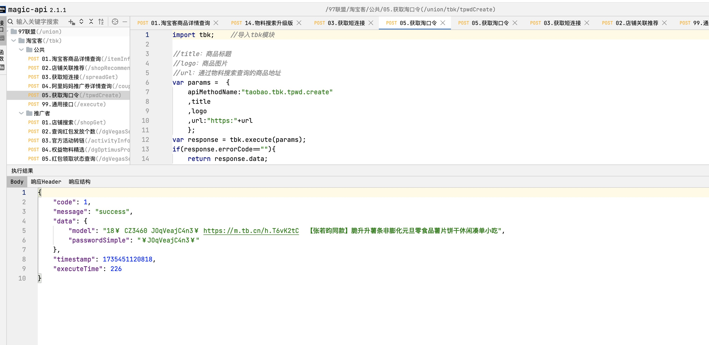

# 基于magic-api的多平台返利系统（xc-union）
项目打造一个基于magic-api的多平台返利系统，支持淘宝联盟、京东联盟、多多进宝、大淘客、好单库(饿了么、唯品会、抖音团购、同程酒店)等主流电商平台的返利对接。

## v1.0.7 版本内容,助力618:
- 添加商品卡片展示；
- 添加淘口令功能。

## v1.0.6 版本内容:
- pom依赖版本统一；
- 增加ui模块(naiveui技术栈)。

## 系统特点
* 支持主流电商平台返利对接
* ai技术
* 开箱即用

## 技术架构
* Java 后端：`master` 分支为 JDK 8 + Spring Boot 2.7.18
* 后端采用magic-api多模块架构
* 数据库使用 MySQL

### 仓库地址
- 仓库地址: https://gitee.com/xc_java/xc-union

# XC-Union 项目结构

## 项目概述
xc-union是一个多平台联盟聚合项目，支持京东、拼多多、美团等多个电商平台的联盟对接。

## 目录结构

```
├── data                           # 数据外置目录
│   ├── magic-api                  # Magic-API接口配置
│   │   └── api                    # API接口定义
│   └── template                   # 模板文件
│       ├── index                  # 首页模板
│       ├── meituan                # 美团相关模板
│       └── tbk                    # 淘宝客模板
│
├── xc-union-sdk                  # SDK模块
│   ├── xc-union-sdk-dtk          # 大淘客SDK
│   ├── xc-union-sdk-giteeai      # Gitee AI SDK
│   ├── xc-union-sdk-hdk          # 好单库SDK
│   ├── xc-union-sdk-jd           # 京东联盟SDK
│   ├── xc-union-sdk-pdd          # 拼多多多多进宝SDK
│   └── xc-union-sdk-tbk          # 淘宝客SDK
│
├── xc-union-service             # 服务模块
│   └── xc-union-magic-api       # Magic-API服务模块
│
├── start-xc-union.sh           # 启动脚本
└── stop-xc-union.sh            # 停止脚本
```


### 演示环境

- 淘宝商品列表（naiveui）：http://tbk.demoeg.com/

- 增加商品列表导购问答页: http://union.demoeg.com/tbk/h5/index_ask.html

- 增加商品列表导购问答（SSE）页: http://union.demoeg.com/tbk/h5/index_ask_sse.html

- 美团集成演示地址: http://union.demoeg.com/meituan/index.html

- 接口地址: http://union.demoeg.com:19999/magic/web/index.html

- 淘宝客集成演示地址: http://union.demoeg.com/tbk/index.html

- 美团集成演示地址: http://union.demoeg.com/meituan/index.html

### 本地访问
- 接口文档: http://127.0.0.1:9999/magic/web/index.html

- 淘宝商品列表（naiveui）：http://localhost:5173

- 淘宝客集成演示地址: http://127.0.0.1:9999/tbk/index.html

- 美团集成演示地址: http://127.0.0.1:9999/meituan/index.html

## 开发环境要求

- JDK: 8+
- Maven: 3.9+
- 模板引擎：enjoy
- MySQL: 5.7+

## 部分功能展示

### 引用场景：

### 淘宝商品卡片列表（naiveui）


### 淘宝商品列表（naiveui）


### 增加商品列表导购问答页


### 好单库接口：淘宝、抖货、饿了么、唯品会、抖音团购、同程酒店


### giteeAi问题


### giteeAi回答


### 美团商品列表


### 个人社区模式商品列表


### 商品列表


### 物料搜索升级版


### 获取短连接


### 获取淘口令


### 多多进宝商品查询


### 多多进宝商品详情查询


# 交流群

| 微信群                                                     | QQ群                                                                                                                                 |
|---------------------------------------------------------|-------------------------------------------------------------------------------------------------------------------------------------|
|  |                                                                                |
| 备注：加群，邀您加入群聊                                            | <a href="https://qm.qq.com/q/9QFlA0wB4" target="_blank">点击加入QQ群：316896422</a> |

